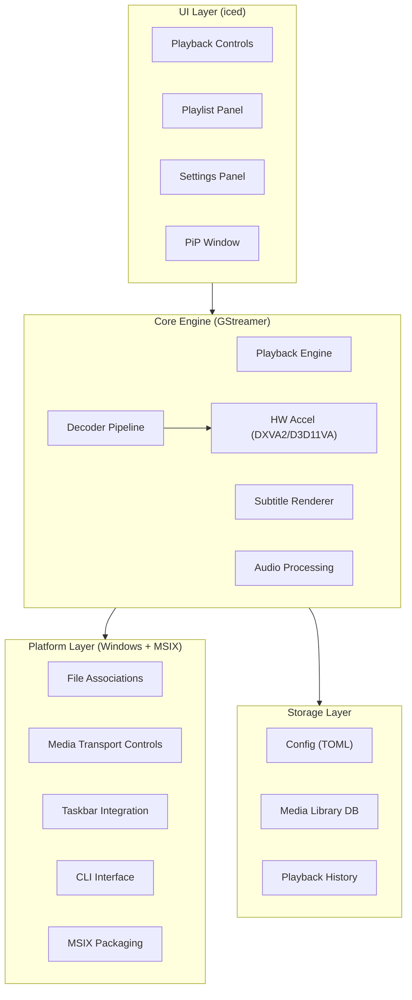

# Product Requirements Document (PRD)

## Velocity — A Modern Video Player for Windows

**Version:** 0.1.0
**Date:** June 20, 2026
**Author:** iamqamar
**Status:** Approved — Ready for Implementation
**License:** MIT / Apache 2.0 (Dual-licensed, Open Source)

---

## 1. Executive Summary

**Velocity** is a high-performance, native Windows video player built entirely in Rust. It aims to be a modern, open-source alternative to VLC Media Player, retaining VLC's legendary format compatibility while introducing a polished, contemporary UI and features that VLC lacks — most notably a first-class **Picture-in-Picture (PiP)** mode, **GPU-accelerated rendering**, and an **ambient/adaptive interface** that follows modern 2026 UX trends.

### Vision Statement

> *"Play anything, beautifully."*

Velocity should feel as fast and reliable as `mpv`, as feature-rich as VLC, and as visually refined as a native Windows app.

---

## 2. Goals & Non-Goals

### Goals

| # | Goal |
| :--- | :--- |
| G1 | Play all common video and audio formats out of the box, matching or exceeding VLC's codec support. |
| G2 | Provide a native, modern Windows UI that feels premium and integrates with Windows design language. |
| G3 | Offer a first-class Picture-in-Picture (PiP) mode with a single click/shortcut. |
| G4 | Achieve low resource usage and fast startup through Rust's performance characteristics. |
| G5 | Support hardware-accelerated decoding (DXVA2 / D3D11VA) for efficient 4K/HDR playback. |
| G6 | Provide a powerful, customizable playlist and media library experience. |
| G7 | Deliver a plugin/extension architecture for community-driven feature growth. |

### Non-Goals (v1.0)

| # | Non-Goal |
| :--- | :--- |
| NG1 | Cross-platform support (macOS, Linux) — deferred to v2.0. |
| NG2 | Streaming server / media server capabilities (e.g., DLNA serving). |
| NG3 | Video editing or transcoding features. |
| NG4 | DRM-protected content playback (e.g., Widevine, PlayReady). |
| NG5 | Built-in AI-powered features (upscaling, subtitle generation) — deferred to v2.0. |

---

## 3. Target Audience

| Persona | Description |
| :--- | :--- |
| **Everyday User** | Wants to double-click a video file and have it play instantly with a clean UI. |
| **Power User** | Needs advanced subtitle control, audio track switching, fine-grained playback speed, and keyboard shortcuts. |
| **Media Enthusiast** | Has large media collections in diverse formats (MKV, HEVC, 4K HDR) and needs reliable, high-quality playback. |
| **Multitasker** | Frequently watches content while working; relies heavily on PiP and always-on-top modes. |

---

## 4. Feature Requirements

### 4.1 Core Playback Engine

| ID | Feature | Priority | Description |
| :--- | :--- | :---: | :--- |
| P-01 | **Universal Format Support** | P0 | Play all major video, audio, and subtitle formats (see §5). |
| P-02 | **Hardware-Accelerated Decoding** | P0 | Leverage DXVA2 / D3D11VA for GPU-accelerated decoding of H.264, HEVC, VP9, and AV1. |
| P-03 | **HDR Playback** | P1 | Support HDR10 and HDR10+ tone mapping for SDR displays, and native HDR passthrough for HDR displays. |
| P-04 | **Variable Playback Speed** | P0 | Adjustable from 0.25× to 4.0× with pitch-corrected audio. |
| P-05 | **Frame-by-Frame Navigation** | P1 | Step forward/backward one frame at a time while paused. |
| P-06 | **A–B Loop** | P1 | Set loop points within a video for repeated playback of a segment. |
| P-07 | **Audio Track Selection** | P0 | Switch between multiple audio tracks embedded in the media file. |
| P-08 | **Audio Equalizer** | P2 | Built-in parametric equalizer with presets and custom profiles. |
| P-09 | **Audio Normalization** | P2 | Automatic volume leveling across tracks and files. |

---

### 4.2 Picture-in-Picture (PiP) & Windowing

> [!IMPORTANT]
> PiP is the flagship differentiating feature. It must be seamless and single-click.

| ID | Feature | Priority | Description |
| :--- | :--- | :---: | :--- |
| W-01 | **One-Click PiP Mode** | P0 | A single button or `Ctrl+P` shortcut shrinks the player to a compact, always-on-top floating window. |
| W-02 | **Resizable PiP Window** | P0 | Freely resizable with maintained aspect ratio. Snap to screen corners. |
| W-03 | **PiP Playback Controls** | P0 | Minimal overlay controls (play/pause, close, expand) appear on hover inside the PiP window. |
| W-04 | **PiP Opacity Control** | P1 | Adjustable window opacity (e.g., 50%–100%) so the user can see content beneath. |
| W-05 | **PiP Click-Through Mode** | P2 | Optional mode where mouse clicks pass through the PiP window to the application beneath. |
| W-06 | **Multi-Monitor PiP** | P1 | PiP window can be moved freely across monitors and remembers its last position per monitor. |
| W-07 | **Mini Player Mode** | P1 | A "mini player" docked to the bottom of the screen showing playback progress and controls. |
| W-08 | **Always-on-Top Toggle** | P0 | Independent of PiP; any window mode can be pinned on top. |

---

### 4.3 Subtitle System

| ID | Feature | Priority | Description |
| :--- | :--- | :---: | :--- |
| S-01 | **Embedded Subtitle Tracks** | P0 | Detect and render embedded SRT, ASS/SSA, PGS, and VobSub subtitle tracks. |
| S-02 | **External Subtitle Loading** | P0 | Auto-detect `.srt`, `.ass`, `.ssa`, `.sub`, `.vtt` files in the same directory; drag-and-drop support. |
| S-03 | **Subtitle Styling** | P1 | Customizable font, size, color, outline, shadow, and position for text-based subtitles. |
| S-04 | **Subtitle Sync Adjustment** | P0 | Manual offset adjustment (± milliseconds) via keyboard shortcut or UI slider. |
| S-05 | **Dual Subtitles** | P2 | Display two subtitle tracks simultaneously (e.g., original language + translation). |
| S-06 | **Subtitle Search & Download** | P2 | Integration with OpenSubtitles API for searching and downloading subtitles by movie hash. |

---

### 4.4 Playlist & Media Library

| ID | Feature | Priority | Description |
| :--- | :--- | :---: | :--- |
| L-01 | **Playlist Panel** | P0 | Collapsible side panel showing the current playlist with drag-and-drop reordering. |
| L-02 | **Playlist Persistence** | P1 | Save and load playlists (`.m3u`, `.m3u8`, `.pls`, `.xspf`). |
| L-03 | **Media Library Scan** | P2 | Scan designated folders, index media files, and display them with metadata and thumbnails. |
| L-04 | **Resume Playback** | P1 | Remember playback position for each file and offer "Resume from where you left off". |
| L-05 | **Recently Played** | P0 | Maintain and display a list of recently opened files. |
| L-06 | **Folder Playback** | P1 | Open and play all media in a folder sequentially or shuffled. |

---

### 4.5 User Interface & Experience

| ID | Feature | Priority | Description |
| :--- | :--- | :---: | :--- |
| U-01 | **Modern Dark Theme** | P0 | Sleek dark UI as the default, with a light theme option. |
| U-02 | **Adaptive/Ambient UI** | P1 | Controls auto-hide during playback and reappear on mouse movement. Smooth fade transitions. |
| U-03 | **Thumbnail Scrubbing** | P1 | Show video thumbnail previews when hovering over the seek bar. |
| U-04 | **Chapter Navigation** | P1 | Display and navigate chapters if the media container includes chapter metadata. |
| U-05 | **OSD (On-Screen Display)** | P0 | Non-intrusive notifications for volume changes, playback speed, subtitle changes, etc. |
| U-06 | **Full-Screen Mode** | P0 | Borderless full-screen with smooth transition animation. Multi-monitor aware. |
| U-07 | **Gesture Controls** | P2 | Mouse gesture support (e.g., scroll to change volume, horizontal swipe to seek). |
| U-08 | **Customizable Keyboard Shortcuts** | P1 | All actions mappable to custom keyboard shortcuts via a settings panel. |
| U-09 | **Context Menu** | P0 | Right-click context menu for quick access to common actions. |
| U-10 | **Drag-and-Drop** | P0 | Drag files or folders onto the player window to open them. |

---

### 4.6 Screenshots & Recording

| ID | Feature | Priority | Description |
| :--- | :--- | :---: | :--- |
| C-01 | **Screenshot Capture** | P1 | Capture the current frame as PNG/JPEG with a configurable save location. |
| C-02 | **Screenshot to Clipboard** | P1 | Copy the current frame directly to the system clipboard. |
| C-03 | **Clip Recording** | P2 | Record a segment of the playing video (with audio) and save as a new file. |

---

### 4.7 System Integration (Windows)

| ID | Feature | Priority | Description |
| :--- | :--- | :---: | :--- |
| I-01 | **File Association** | P0 | Register as a handler for all supported media file types during installation. |
| I-02 | **Taskbar Thumbnail Controls** | P1 | Play/Pause/Stop buttons in the Windows taskbar thumbnail preview. |
| I-03 | **System Media Transport Controls** | P1 | Integrate with Windows SMTC (media overlay on keyboard media keys). |
| I-04 | **Command-Line Interface** | P1 | `velocity.exe <file> [--pip] [--fullscreen] [--volume 80]` style CLI flags. |
| I-05 | **Single Instance Mode** | P1 | Option to reuse the running instance when opening new files, or allow multiple instances. |
| I-06 | **Portable Mode** | P2 | Run without installation; store settings alongside the executable. |
| I-07 | **Auto-Updates** | P2 | Check for and install updates from a release server. |

---

### 4.8 Streaming & Network Playback

| ID | Feature | Priority | Description |
| :--- | :--- | :---: | :--- |
| N-01 | **Open URL** | P1 | Play media from HTTP/HTTPS URLs. |
| N-02 | **RTSP/RTP Streams** | P2 | Play live streams from IP cameras and RTSP sources. |
| N-03 | **HLS / DASH Streams** | P2 | Play adaptive bitrate streams (HLS `.m3u8`, MPEG-DASH `.mpd`). |
| N-04 | **YouTube URL Support** | P2 | Parse and play YouTube URLs via `yt-dlp` integration (optional external dependency). |

---

## 5. Supported Formats

### 5.1 Video Codecs

| Codec | Extensions / Names | HW Accel | Priority |
| :--- | :--- | :---: | :---: |
| H.264 / AVC | — | ✅ DXVA2/D3D11 | P0 |
| H.265 / HEVC | — | ✅ DXVA2/D3D11 | P0 |
| AV1 | — | ✅ D3D11 (if GPU supported) | P0 |
| VP8 | — | ❌ | P1 |
| VP9 | — | ✅ D3D11 | P0 |
| MPEG-1 | — | ❌ | P1 |
| MPEG-2 | — | ✅ DXVA2 | P1 |
| MPEG-4 Part 2 | DivX, Xvid | ❌ | P1 |
| VC-1 / WMV3 | — | ✅ DXVA2 | P1 |
| Theora | — | ❌ | P2 |
| ProRes | — | ❌ | P2 |
| FFV1 | — | ❌ | P2 |

### 5.2 Audio Codecs

| Codec | Priority |
| :--- | :---: |
| AAC (LC, HE, HEv2) | P0 |
| MP3 (MPEG Layer III) | P0 |
| FLAC | P0 |
| Opus | P0 |
| Vorbis | P0 |
| AC-3 (Dolby Digital) | P1 |
| E-AC-3 (Dolby Digital Plus) | P1 |
| DTS / DTS-HD | P1 |
| PCM (WAV) | P0 |
| WMA | P1 |
| ALAC (Apple Lossless) | P2 |
| TrueHD | P2 |

### 5.3 Container Formats

| Format | Extension(s) | Priority |
| :--- | :--- | :---: |
| MPEG-4 Part 14 | `.mp4`, `.m4v`, `.m4a` | P0 |
| Matroska | `.mkv`, `.mka`, `.mk3d` | P0 |
| WebM | `.webm` | P0 |
| AVI | `.avi` | P0 |
| QuickTime | `.mov` | P1 |
| MPEG Transport Stream | `.ts`, `.mts`, `.m2ts` | P1 |
| MPEG Program Stream | `.mpg`, `.mpeg`, `.vob` | P1 |
| Flash Video | `.flv` | P2 |
| Windows Media | `.wmv`, `.asf` | P1 |
| Ogg | `.ogg`, `.ogv`, `.ogm` | P1 |
| 3GP | `.3gp`, `.3g2` | P2 |
| WAV | `.wav` | P0 |

### 5.4 Subtitle Formats

| Format | Extension(s) | Priority |
| :--- | :--- | :---: |
| SubRip | `.srt` | P0 |
| ASS / SSA | `.ass`, `.ssa` | P0 |
| WebVTT | `.vtt` | P1 |
| PGS (Blu-ray) | Embedded in `.mkv`/`.m2ts` | P1 |
| VobSub | `.sub` + `.idx` | P1 |
| TTML | `.ttml`, `.dfxp` | P2 |
| MicroDVD | `.sub` | P2 |

### 5.5 Playlist Formats

| Format | Extension(s) | Priority |
| :--- | :--- | :---: |
| M3U / M3U8 | `.m3u`, `.m3u8` | P0 |
| PLS | `.pls` | P1 |
| XSPF | `.xspf` | P2 |
| CUE Sheet | `.cue` | P2 |

---

## 6. Technical Architecture

### 6.1 Technology Stack

| Layer | Technology | Rationale |
| :--- | :--- | :--- |
| **Language** | Rust (Edition 2024) | Memory safety, zero-cost abstractions, no GC pauses. |
| **Multimedia Backend** | GStreamer via `gstreamer-rs` | ✅ **Confirmed.** Mature pipeline-based framework with broad codec support; excellent Rust bindings. |
| **FFmpeg Integration** | `ffmpeg-next` or `rsmpeg` (optional) | For advanced media analysis, thumbnail generation, and format probing. |
| **GUI Framework** | **iced** | ✅ **Confirmed.** Pure-Rust, Elm-architecture, GPU-rendered. Ideal for media-centric UIs. |
| **Windowing / Platform** | `winit` + Windows APIs (`windows-rs`) | Native window management, system tray, file association, SMTC integration. |
| **GPU Rendering** | `wgpu` (via iced backend) | Cross-API GPU rendering (Direct3D 12/11, Vulkan). |
| **Audio Output** | `cpal` or GStreamer audio sink | Low-latency audio output. |
| **Configuration** | `serde` + TOML | Human-readable config files. |
| **Installer / Packaging** | **MSIX** | ✅ **Confirmed.** Modern Windows packaging with clean install/uninstall, sandboxed security, and SMTC/notification API access via Package Identity. |
| **License** | MIT / Apache 2.0 (dual) | ✅ **Confirmed.** Permissive open-source licensing for maximum community adoption. |

### 6.2 High-Level Architecture Diagram



### 6.3 Module Breakdown

```text
velocity/
├── Cargo.toml
├── LICENSE-MIT
├── LICENSE-APACHE
├── README.md
├── packaging/
│   ├── AppxManifest.xml        # MSIX manifest
│   ├── Assets/                 # App icons for MSIX (logos, tiles)
│   └── build_msix.ps1          # MSIX packaging script
├── src/
│   ├── main.rs                 # Entry point, CLI parsing, app launch
│   ├── app.rs                  # Top-level iced Application state & message loop
│   ├── ui/
│   │   ├── mod.rs
│   │   ├── player_view.rs      # Main playback viewport
│   │   ├── controls.rs         # Playback controls bar
│   │   ├── seekbar.rs          # Seek bar with thumbnail preview
│   │   ├── pip_window.rs       # PiP overlay window
│   │   ├── playlist_panel.rs   # Playlist sidebar
│   │   ├── settings_panel.rs   # Settings / preferences UI
│   │   ├── osd.rs              # On-screen display notifications
│   │   └── theme.rs            # Dark/light theme definitions
│   ├── engine/
│   │   ├── mod.rs
│   │   ├── pipeline.rs         # GStreamer pipeline management
│   │   ├── decoder.rs          # Codec & HW accel configuration
│   │   ├── audio.rs            # Audio output, equalizer, normalization
│   │   └── subtitle.rs         # Subtitle parsing & rendering
│   ├── media/
│   │   ├── mod.rs
│   │   ├── format.rs           # Format detection & probing
│   │   ├── playlist.rs         # Playlist parsing (M3U, PLS, XSPF)
│   │   └── library.rs          # Media library scanning & indexing
│   ├── platform/
│   │   ├── mod.rs
│   │   ├── windows.rs          # Windows-specific APIs (SMTC, taskbar, file assoc)
│   │   ├── cli.rs              # Command-line argument parsing
│   │   └── config.rs           # Configuration loading / saving (TOML)
│   └── utils/
│       ├── mod.rs
│       ├── time.rs             # Time formatting utilities
│       └── logger.rs           # Logging setup
└── tests/
    ├── playback_tests.rs
    ├── subtitle_tests.rs
    └── playlist_tests.rs
```

---

## 7. Non-Functional Requirements

| Category | Requirement |
| :--- | :--- |
| **Startup Time** | Cold start to first frame in < 1.5 seconds for a local MP4 file. |
| **Memory Usage** | Idle memory < 80 MB. During 4K HEVC playback < 300 MB. |
| **CPU Usage** | < 5% CPU on HW-accelerated 1080p playback (modern hardware). |
| **File Size** | MSIX package < 50 MB. Portable binary < 30 MB (excluding GStreamer runtime). |
| **OS Support** | Windows 10 (version 1903+) and Windows 11. |
| **Accessibility** | Keyboard-navigable UI; screen reader friendly labels on all controls. |
| **Localization** | English (default). Architecture supports i18n for future languages. |
| **Logging** | Structured logging with configurable verbosity (`tracing` crate). |

---

## 8. Keyboard Shortcuts (Default)

| Shortcut | Action |
| :--- | :--- |
| `Space` | Play / Pause |
| `F` | Toggle Full-Screen |
| `Ctrl+P` | Toggle PiP Mode |
| `Escape` | Exit Full-Screen / PiP |
| `→` / `←` | Seek forward / backward 5s |
| `Shift+→` / `Shift+←` | Seek forward / backward 30s |
| `↑` / `↓` | Volume up / down |
| `M` | Mute / Unmute |
| `[` / `]` | Decrease / Increase playback speed |
| `Backspace` | Reset playback speed to 1.0× |
| `.` / `,` | Next / Previous frame (when paused) |
| `S` | Take screenshot |
| `L` | Toggle playlist panel |
| `V` | Cycle subtitle tracks |
| `B` | Cycle audio tracks |
| `T` | Toggle always-on-top |
| `Ctrl+O` | Open file |
| `Ctrl+U` | Open URL |
| `Ctrl+Q` | Quit |

---

## 9. Competitive Analysis

| Feature | **Velocity** (Planned) | VLC | mpv | PotPlayer |
| :--- | :---: | :---: | :---: | :---: |
| One-Click PiP | ✅ | ❌ (manual workaround) | ❌ | ⚠️ (partial) |
| PiP Opacity / Click-Through | ✅ | ❌ | ❌ | ⚠️ |
| Modern UI (iced) | ✅ | ❌ (dated) | ❌ (minimal) | ⚠️ (complex) |
| Hardware Acceleration | ✅ | ✅ | ✅ | ✅ |
| HDR Support | ✅ | ✅ | ✅ | ✅ |
| Thumbnail Scrubbing | ✅ | ❌ | ❌ | ✅ |
| Dual Subtitles | ✅ | ❌ | ✅ | ✅ |
| Low Resource Usage | ✅ | ⚠️ | ✅ | ⚠️ |
| Plugin System | ✅ (v1.x) | ✅ | ✅ (scripts) | ❌ |
| Open Source (MIT/Apache 2.0) | ✅ | ✅ (GPL) | ✅ (GPL) | ❌ |

---

## 10. Release Phases

### Phase 1 — MVP (v0.1.0)
> Core playback with a clean UI.

- P0 playback features (play, pause, seek, volume)
- MP4 / MKV / WebM / AVI container support
- H.264, HEVC, VP9, AV1 decoding (with HW accel)
- Basic subtitle support (SRT, ASS)
- Dark theme UI with adaptive control hiding
- Drag-and-drop file opening
- Full-screen mode

### Phase 2 — PiP & Polish (v0.2.0)
> The PiP release — the flagship differentiator.

- One-click PiP mode with resizable, always-on-top window
- PiP overlay controls and opacity adjustment
- Playlist panel with drag-and-drop reordering
- Resume playback, recently played list
- Thumbnail seek bar preview
- Customizable keyboard shortcuts
- Screenshot capture

### Phase 3 — Power Features (v0.3.0)
> For power users and media enthusiasts.

- Audio equalizer and normalization
- Dual subtitles and subtitle download
- Chapter navigation
- Streaming support (URL, HLS, RTSP)
- Windows SMTC & taskbar integration
- CLI flags
- MSIX installer with file associations

### Phase 4 — Ecosystem (v1.0.0)
> Stable release with community features.

- Plugin / extension architecture
- Media library with folder scanning
- Clip recording
- Portable mode (standalone `.exe` with local config)
- MSIX auto-update via App Installer protocol
- Comprehensive accessibility audit
- Microsoft Store listing (optional)

---

## 11. Risks & Mitigations

| Risk | Impact | Likelihood | Mitigation |
| :--- | :---: | :---: | :--- |
| GStreamer Windows bundling in MSIX | High | Medium | Bundle GStreamer runtime DLLs inside the MSIX package; use `gstreamer-rs` build scripts with `GST_PLUGIN_PATH` pointing to package-relative paths. |
| HDR tone-mapping quality issues | Medium | Medium | Leverage GStreamer's `d3d11` video sink which has built-in tone mapping. |
| iced limitations for video rendering | Medium | Low | Use iced's `Shader` widget or raw `wgpu` surface for GPU-rendered video frames; fall back to software blitting if needed. |
| PiP window management on Windows | Medium | Medium | Use `windows-rs` for fine-grained window control (`SetWindowPos`, `WS_EX_TOPMOST`, `SetLayeredWindowAttributes`). |
| MSIX sandboxing restricting file access | Medium | Low | Use `broadFileSystemAccess` restricted capability in AppxManifest; user grants permission on first run. |
| Subtitle rendering performance (ASS) | Low | Medium | Use `libass` via FFI for complex styled subtitles. |

---

## 12. Success Metrics

| Metric | Target |
| :--- | :--- |
| Cold start to first frame | < 1.5 seconds |
| Format compatibility rate (vs. VLC test suite) | ≥ 95% |
| PiP activation latency | < 200ms |
| Memory footprint (1080p playback) | < 150 MB |
| User-reported crash rate | < 0.1% of sessions |

---

## 13. Resolved Decisions

All key decisions have been finalized as of June 20, 2026.

| # | Decision | Choice | Rationale |
| :--- | :--- | :--- | :--- |
| 1 | **GUI Framework** | **iced** | Pure Rust, Elm-architecture with structured state management, GPU-rendered via `wgpu`. Best fit for a complex desktop application with multiple window modes (main, PiP, mini player). |
| 2 | **Licensing Model** | **MIT / Apache 2.0** (dual-licensed) | Permissive open-source licensing maximizes community adoption and contribution while remaining compatible with commercial use. |
| 3 | **Installer Strategy** | **MSIX** | Modern Windows packaging format providing clean install/uninstall, containerized security, automatic updates via App Installer, and Package Identity for access to Windows APIs (SMTC, notifications, Start Menu tiles). Recommended over MSI for consumer-facing apps with no need for low-level drivers or global registry writes. |
| 4 | **Project Name** | **Velocity** | Final product name. Binary: `velocity.exe`. Package: `Velocity`. |
| 5 | **Multimedia Backend** | **GStreamer** (via `gstreamer-rs`) | Industry-standard pipeline-based multimedia framework with built-in A/V sync, HW acceleration, and broad codec coverage. GStreamer runtime DLLs will be bundled inside the MSIX package. |
